<h2 align="center">
    <a href="https://dainam.edu.vn/vi/khoa-cong-nghe-thong-tin">
    🎓 Faculty of Information Technology (DaiNam University)
    </a>
</h2>
<h2 align="center">
    Quản lý tài sản + Quản lý Tài chính/Kế toán
</h2>
<div align="center">
    <p align="center">
        
        
        
    </p>

[](https://www.facebook.com/DNUAIoTLab)
[](https://dainam.edu.vn/vi/khoa-cong-nghe-thong-tin)
[](https://dainam.edu.vn)

</div>

## 🎓 Giới thiệu

Nền tảng ERP được phát triển dựa trên Odoo, phục vụ đào tạo và thực hành tại Khoa Công nghệ Thông tin, Đại học Đại Nam. Hệ thống tích hợp các phân hệ quản lý tài sản, tài chính/kế toán và nhân sự, phù hợp cho các dự án thực tập, nghiên cứu và triển khai thực tế.

---

## ⚙️ Các phân hệ chính

### 1. Quản lý Tài sản
- Quản lý thông tin tài sản, loại tài sản, vị trí, nhà cung cấp
- Theo dõi nhập/xuất, lịch sử sử dụng, bảo trì, di chuyển
- Tính toán khấu hao tài sản
- Quản lý phòng họp, đặt phòng, bảo trì, nâng cấp

### 2. Kế toán Tài sản
- Quản lý danh mục tài khoản kế toán
- Tự động khấu hao tài sản hàng tháng (Cron Job)
- Sinh bút toán kế toán tự động (account.move)
- Quản lý thu/chi, ngân sách, công nợ, hóa đơn, sao kê, tính thuế
- Liên kết chặt chẽ với phân hệ Quản lý Tài sản và Nhân sự
- Tích hợp AI: dự đoán thời điểm bảo trì/thanh lý, phân tích hiệu quả sử dụng tài sản
- Phù hợp chuẩn kế toán Việt Nam, Odoo 15 Community/Enterprise

### 3. Nhân sự
- Quản lý hồ sơ nhân viên, chức vụ, đơn vị công tác
- Theo dõi lịch sử công tác, chứng chỉ, bằng cấp
- Quản lý quy trình tuyển dụng, đào tạo, đánh giá

---

## 📸 Giao diện & Chức năng

### AI Trợ lý Thông minh & Phân tích
Tích hợp trí tuệ nhân tạo để hỗ trợ người dùng, dự đoán và phân tích dữ liệu.

| AI Chatbot | Cấu hình & Kết nối |
|:---:|:---:|
| 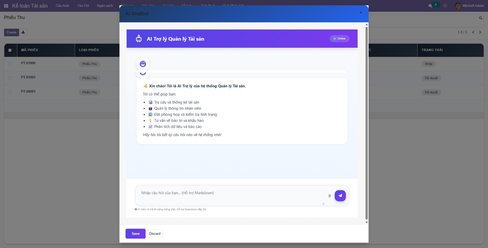 | 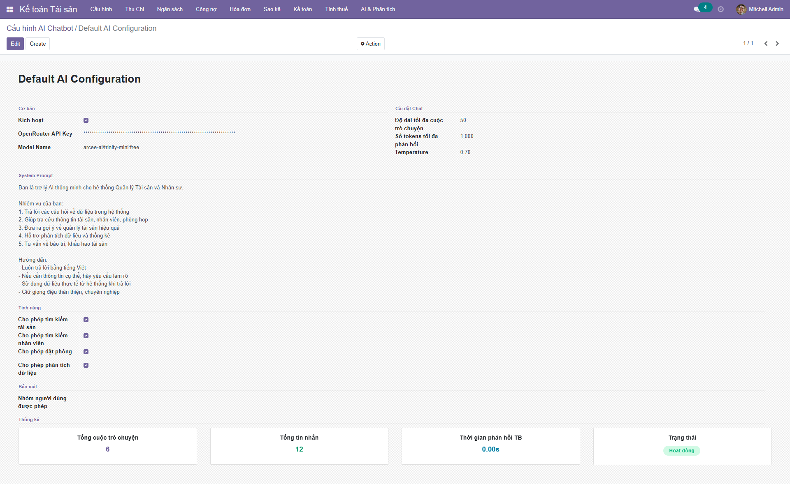 |
| *Giao diện Chatbot hỗ trợ người dùng 24/7* | *Cấu hình kết nối với các mô hình AI* |

| Dự báo & Phân tích | Hiệu quả sử dụng |
|:---:|:---:|
| 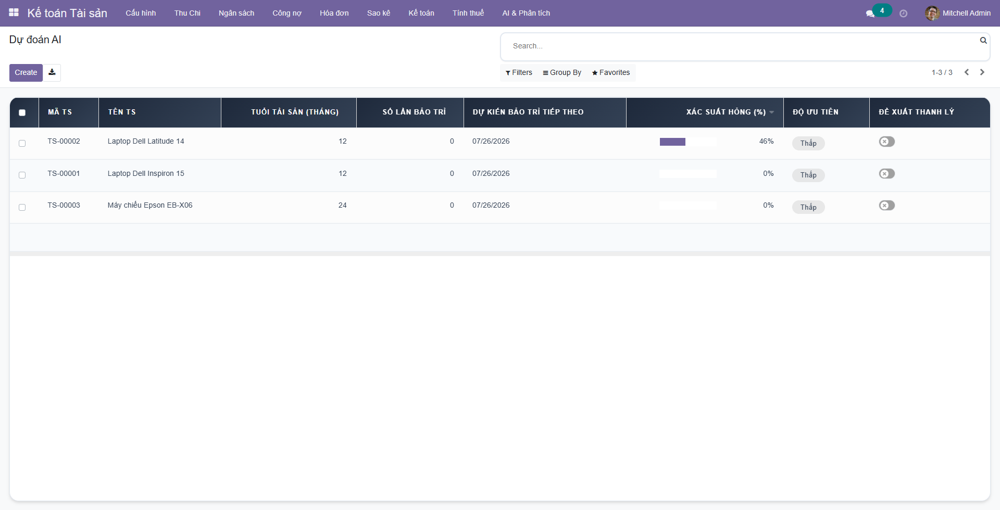 | 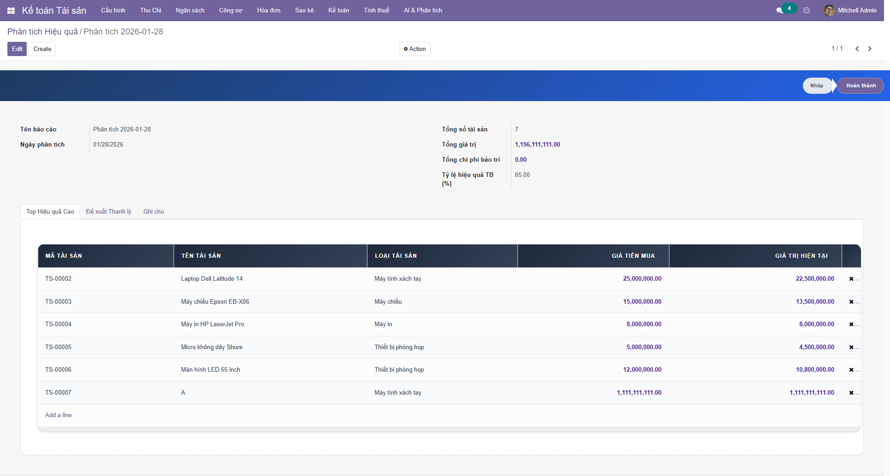 |
| *Dự đoán xu hướng bảo trì và khấu hao* | *Phân tích hiệu quả khai thác tài sản* |

### Phân hệ Quản lý Tài sản
Quản lý toàn diện vòng đời tài sản từ mua sắm đến thanh lý.

| Danh sách Tài sản | Quản lý Vị trí |
|:---:|:---:|
| 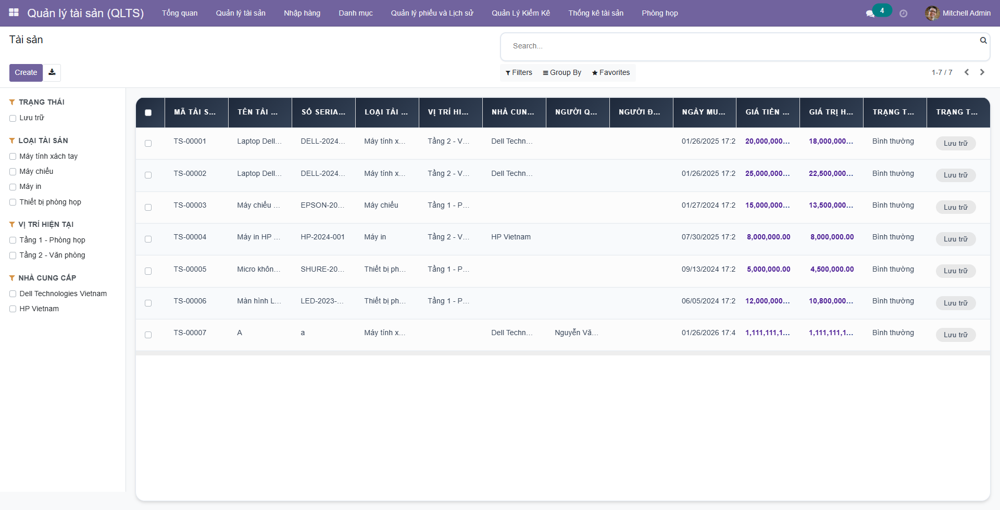 | 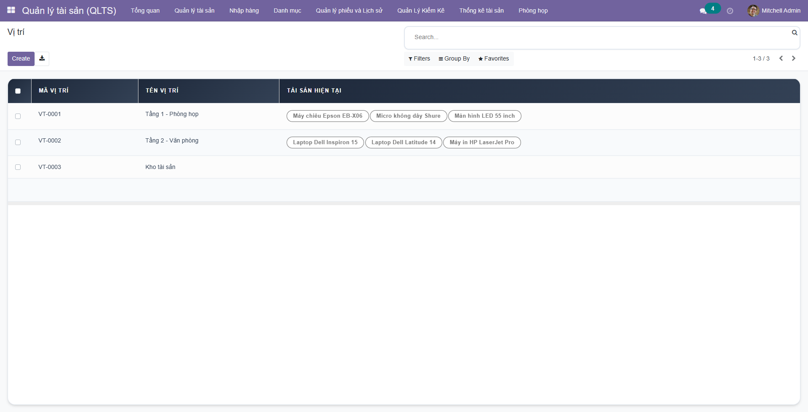 |
| *Danh sách tài sản chi tiết* | *Sơ đồ vị trí và bố trí tài sản* |

| Mượn / Trả | Biểu đồ Phân bổ |
|:---:|:---:|
| 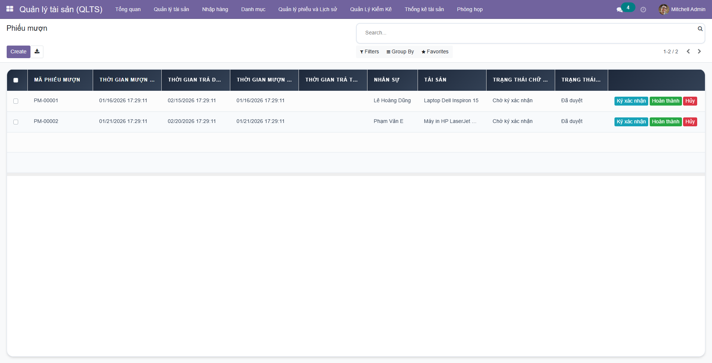 | 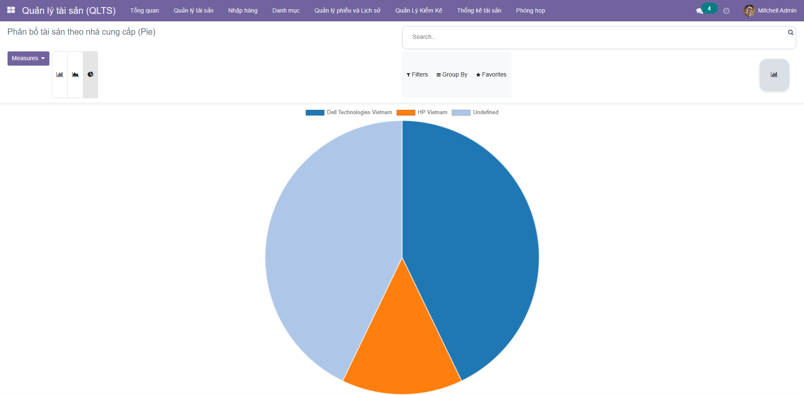 |
| *Quản lý quy trình mượn trả* | *Thống kê tài sản theo nhà cung cấp* |

### Phân hệ Nhân sự (HR)
Quản lý hồ sơ nhân sự, quá trình công tác và năng lực nhân viên.

| Hồ sơ Nhân viên | Bằng cấp & Chứng chỉ |
|:---:|:---:|
| 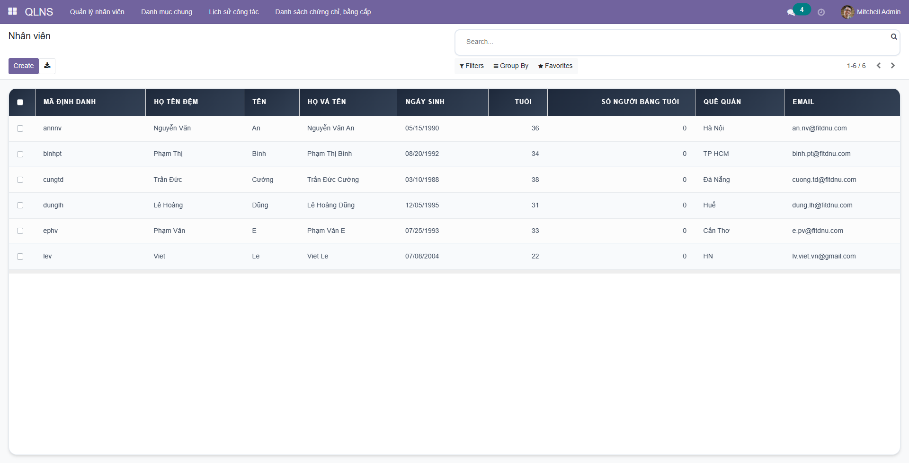 | 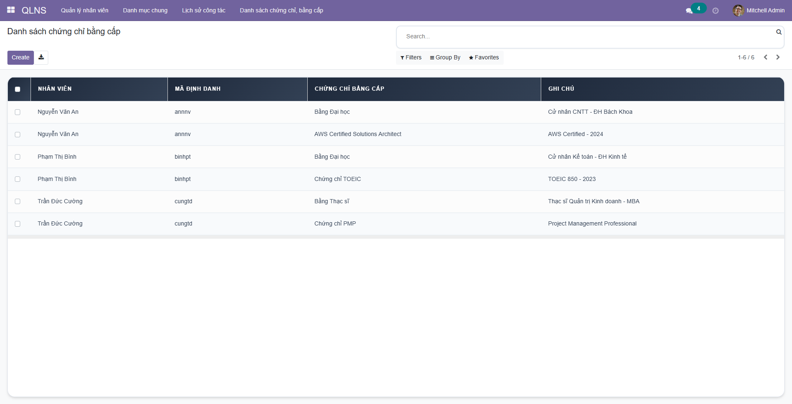 |
| *Danh sách nhân sự* | *Quản lý hồ sơ năng lực* |

| Lịch sử Công tác | |
|:---:|:---:|
| 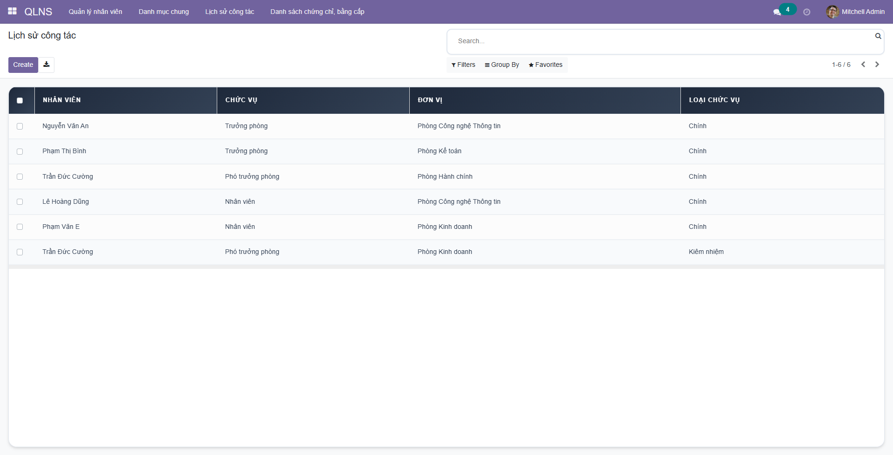 | |
| *Theo dõi quá trình làm việc* | |

### Phân hệ Kế toán Tài sản
Hạch toán tự động và quản lý tài chính liên quan đến tài sản.

| Dashboard Kế toán | Hệ thống Tài khoản |
|:---:|:---:|
| 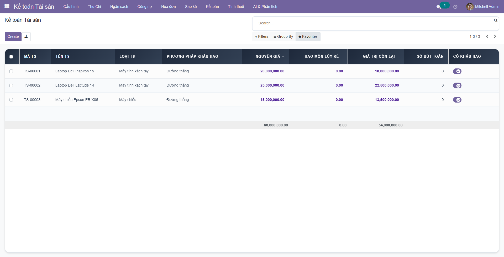 | 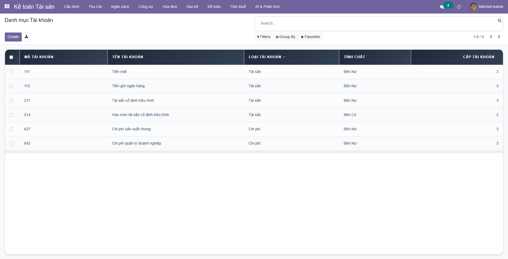 |
| *Tổng quan tình hình tài chính* | *Cây danh mục tài khoản kế toán* |

| Ngân sách & Thu Chi | Biểu đồ Giá trị |
|:---:|:---:|
| 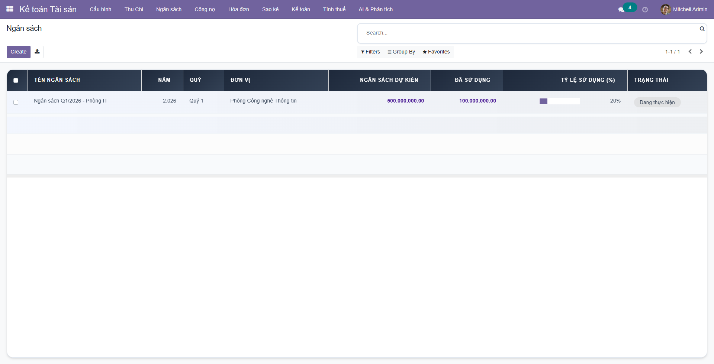 | 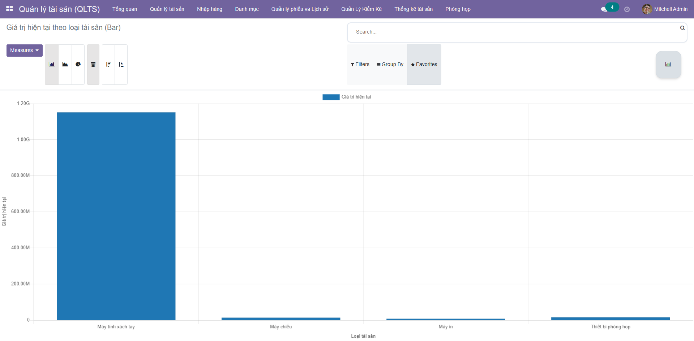 |
| *Quản lý ngân sách dự án* | *Thống kê giá trị hiện tại của tài sản* |

---

## 🔧 Công nghệ sử dụng
- **Odoo** (Python, JavaScript, XML)
- **PostgreSQL**
- **Docker** (cài đặt nhanh môi trường)
- **Ubuntu**
- **OpenRouter API** (Tích hợp AI)

---

## 🚀 Hướng dẫn cài đặt

### 1. Cài đặt môi trường
```bash
sudo apt-get install libxml2-dev libxslt-dev libldap2-dev libsasl2-dev libssl-dev python3.10-distutils python3.10-dev build-essential libssl-dev libffi-dev zlib1g-dev python3.10-venv libpq-dev
```

### 2. Tạo môi trường ảo và cài thư viện Python
```bash
python3.10 -m venv ./venv
source venv/bin/activate
pip3 install -r requirements.txt
```

### 3. Khởi tạo database bằng Docker
```bash
sudo docker-compose up -d
```

### 4. Cấu hình hệ thống
Tạo file `odoo.conf`:
```
[options]
addons_path = addons
db_host = localhost
db_password = odoo
db_user = odoo
db_port = 5431
xmlrpc_port = 8069
```

### 5. Khởi động hệ thống
```bash
python3 odoo-bin.py -c odoo.conf -u all
```
Truy cập: http://localhost:8069/

---

## 📄 License
© 2024 AIoTLab, Faculty of Information Technology, DaiNam University. All rights reserved.
